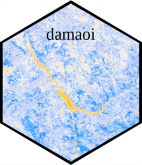
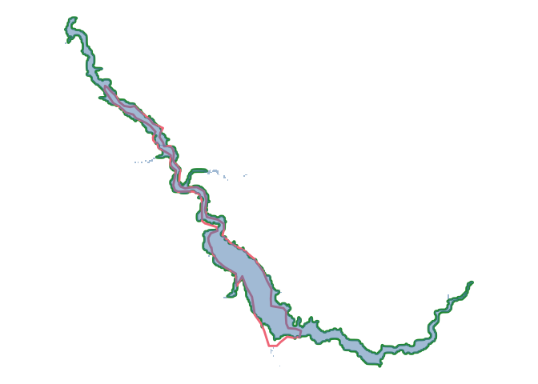
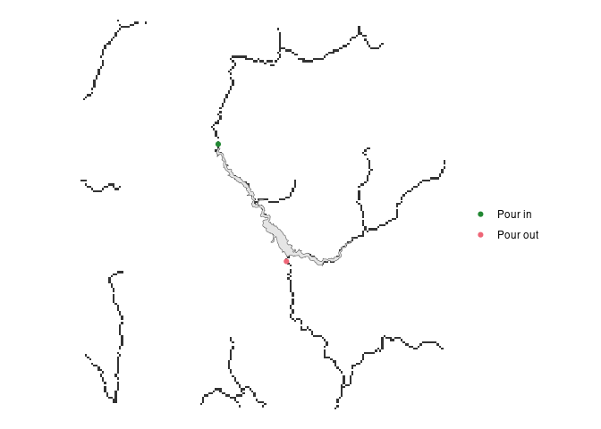
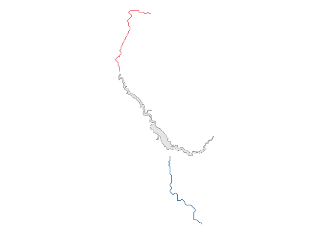
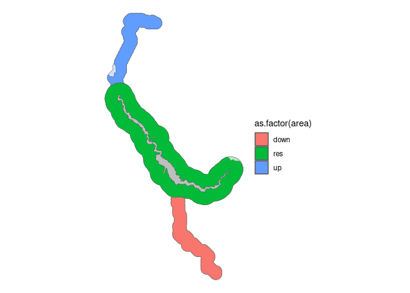
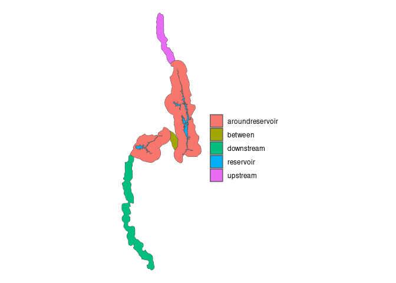

<!-- README.md is generated from README.Rmd. Please edit that file -->

# damaoi 

<!-- badges: start -->
<!-- badges: end -->

# The “damAOI” application

The “damAOI” application allows researchers to create AOIs which are at
the same time locally nuanced and consistent across contexts. We use
data sources on elevation, river flow, water bodies and dam construction
sites to allow researchers to programmatically define their AOIs. The
application was written in statistical software *R* and is designed to
help standardize the way we consider the impacts of dams.

## Data preprocessing

### Reproject and align

The functions in damAOI use the following input data:

- The polygon of reservoirs created by dams. These are typically taken
  from the [Global Reservoir and Dams (GRanD)
  dataset](https://sedac.ciesin.columbia.edu/data/collection/grand-v1/methods).
- The polygons of river basins derived by
  [HydroBASINS](https://www.hydrosheds.org/products/hydrobasins).
- Digital Elevation Model (DEM) and Flow ACcumulation (FAC) data from
  [HydroSHEDS](https://www.hydrosheds.org/hydrosheds-core-downloads).
- Surface water extent data from the [European Space Agency (ESA)
  Climate Change Initiative
  (CCI)](https://www.esa-landcover-cci.org/?q=node/162).

Input data can come in many different projections. The *preprocessing*
function reprojects all spatial data to the Universal Transverse
Mercator (UTM) zone where a reservoir is located, and crops it to a
pre-specified distance away from the reservoir defined by the
*riverdistance* parameter.

Here we show how to use the preprocessing function for the package data
on Tehri Dam in Uttarakhand, India.

``` r

# load package data

fac_tehri <- rast("./inst/extdata/fac_tehri.tif")
dem_tehri <- rast("./inst/extdata/dem_tehri.tif")
wb_tehri <- rast("./inst/extdata/wb_tehri.tif")

# preprocess data

preprocessed <- preprocessing(
    reservoir = tehri, 
    dem = dem_tehri, 
    fac = fac_tehri, 
    water_bodies = wb_tehri,
    basins = basins_tehri, 
    river_distance = 30000)

  tehri_utm <- preprocessed[[1]]
  tehri_dem_utm <- preprocessed[[2]]
  tehri_fac_utm <- preprocessed[[3]]
  basins_tehri_utm <- preprocessed[[4]]
  tehri_wb_utm <- preprocessed[[5]]
  espg <- preprocessed[[7]]
```

### Reservoir polygon corrections

Polygons of dam reservoirs are usually obtained from global
georeferenced datasets. Some polygons in these datasets are inconsistent
with true water extent of reservoirs, largely because of inconsistencies
in the time of year that reservoir extents are measured or when to
consider a wide river as part of the reservoir. The
*adjustreservoirpolygon* function in our application allows users to
match water cover of a background source of water extent. We suggest the
CCI Global Water Bodies dataset: for larger dams the 300m<sup>2</sup>
resolution is sufficient, and the globally consistent algorithm for
determining surface water extent is key.

``` r

# adjust original polygon using flow accumulation and water bodies data.

tehri_adjusted <- adjustreservoirpolygon(
  reservoir = tehri_utm, 
  water_bodies = tehri_wb_utm, 
  dem = tehri_dem_utm)

# create a data frame for water body data for plotting
wbdf <- as.data.frame(crop(tehri_wb_utm,tehri_adjusted), xy=T)

ggplot() + 
  geom_sf(data = tehri_adjusted, col = '#228833', fill = NA, lwd = 1) + # adjusted polygon
  geom_sf(data = tehri_utm, col = '#EE6677', fill = NA, lwd = 1) + # original polygon
  geom_tile(data = wbdf, aes(x = x, y = y), fill =  '#4477AA', alpha = 0.5) + # CCI water bodies
  theme_void()
```



Here the green outline shows the adjusted polygon, the red outline shows
the original polygon, and the background blue shows the water bodies
data from the CCI.

### Pour points

Pour points are the locations where rivers pour into and out of
reservoirs. For many reservoirs, pour points can be found automatically.
The pour in point(s) – where the upstream river(s) join reservoirs –
typically experience the largest difference in accumulated flow, which
can be computed directly from FAC hydrology data. The pour out point –
the dam location – is often known. This can also be derived using the
maximum FAC value of the reservoir. For other reservoirs, pour points
need to be determined by users and in our package we have developed a
Shiny app which lets users select pour points using a leaflet map. This
is for reservoirs with irregular shapes or when many rivers feed into a
single reservoir.

``` r

# automatically get pour points using reservoir and flow accumulation data 
pourpoints <- autogetpourpoints(
    reservoir = tehri_adjusted, 
    fac = tehri_fac_utm)
st_crs(pourpoints) <- st_crs(tehri_adjusted) 

# convert flow accumulation data to a data frame for plotting

facdf <- as.data.frame(tehri_fac_utm, xy = T)

ggplot() +
  geom_tile(data = facdf, aes(x = x, y = y)) +
  geom_sf(data = tehri_adjusted) +
  geom_sf(data = pourpoints, aes(col = as.factor(direction))) +
  scale_color_manual(
    values = c('#228833','#EE6677'),
    labels = c("Pour in", "Pour out")) +
  theme_void() +
  labs(col = "")
```



## Build river lines

To map river paths digitally, we built an algorithm using Digital
Elevation Model (DEM) data and Flow ACumulation data (FAC). We recommend
using HydroSHEDS 15s data as input data for the algorithm. The DEM
contains the average elevation in each grid cell in meters. FAC values
are unitless, and simply measure the aggregated number of cells (in this
case ~450m grid cells) that have accumulated to form the river at each
cell. If a river was 200 cells long, and was joined by another 300 cells
long, the flow accumulation one cell downstream of the confluence would
be 501.

For the downstream river line the algorithm begins at the point in the
reservoir with the highest accumulation. It searches nearby grid cells
in the FAC data which are ‘water’ and selects the nearest point with a
higher accumulation and a lower elevation. This is an iterative process,
and continues for as far downstream as the user wishes to consider. For
us, the default is 100km downstream.

For the upstream river line the algorithm begins at the point in the
reservoir with the lowest accumulation. It searches nearby points which
have water of a similar accumulation (to eliminate the river being
diverted to insignificant upstream springs). Of these cells, it selects
the nearest point with a lower accumulation and a higher elevation. This
process is again repeated iteratively up to a set distance away from the
reservoir.

``` r

riverpoints <- lapply(X = 1:2, # for each of the two pourpoints
                      FUN = getriverpoints, # run the getriverpoints function
                      reservoir = tehri_adjusted, 
                      pourpoints = pourpoints,
                      river_distance = 30000,
                      ac_tolerance = 50,
                      e_tolerance = 10, 
                       nn = 20, 
                      fac = tehri_fac_utm,
                      dem = tehri_dem_utm)

# converts each list of points into an sf LINESTRING

riverlines <- pointstolines(riverpoints, espg = espg)

ggplot(tehri_adjusted) +
  geom_sf() +
  geom_sf(data = riverlines[[1]], col = '#EE6677') +
  geom_sf(data = riverlines[[2]], col = '#4477AA') +
  theme_void()
```



This is done with the *riverpoints* function. The *river_distance*
parameter sets how far upstream and downstream to follow the river. The
*nn* parameter sets the number of nearest neighbours (water bodies) to
assess for these conditions. The *ac_tolerance* parameter sets a
threshold for the point-to-point flow accumulation increase. This is so
that at major confluences the algorithm will stop finding points
downstream. The *e_tolerance* parameter sets a threshold for the
acceptable elevation increase if there are no points downstream
(upstream) which have a lower (higher) elevation. This is important as
downstream points can erroneously have a slightly higher elevation value
in steep gorges because DEM values are an average across an area which
can be larger than the width of rivers.

The *pointstolines* function converts the points and associated
information generated by *riverpoints* to an sf linestring.

## Build AOI polygons

``` r

# creates buffers around river lines and reservoir buffers.

bnb <- basinandbuffers(
  reservoir = tehri_adjusted,
  upstream = riverlines[[1]],
  downstream = riverlines[[2]],
  basins = basins_tehri_utm,
  streambuffersize = 1500,
  reservoirbuffersize = 3000)

ggplot(bnb[[1]] %>% mutate(area = c("res", "down", "up"))) +
  geom_sf(aes(fill = as.factor(area)), alpha = 0.3) +
  geom_sf(data = bnb[[2]] %>% mutate(area = c("res", "down", "up")),
          aes(fill = as.factor(area))) +
  geom_sf(data = tehri_adjusted, fill = "grey") +
  theme_void()
```



The *basinsandbuffers* function extracts buffers for the lines and
reservoir first. The *streambuffersize* parameter defines the size of
the buffer around river lines. The *reservoirbuffersize* parameter
defines the size of buffer around the reservoir. Once buffers have been
calculated, the function clips these areas by the river basins, so that
areas beyond topographical barriers to water are not considered. Here
shows the overlay of clipped polygons and the buffers themselves in
lighter tone.

## Dam systems

Some rivers have many connected dams and reservoirs. The method we
propose for such dam systems is to first calculate AOIs for each dam in
the system and second to correct these polygons to avoid overlapping
areas. The *makesystems* function implements this using the AOIs for all
dams which form a system on the same river. Reservoirs for each dam are
combined into an sf MULTIPOLYGON of all reservoirs. Areas around
reservoirs are combined, ensuring that they exclude any areas which are
reservoirs of other dams on the system. Upstream areas are defined as
the upstream area of the reservoir in the system with the highest
elevation. Downstream areas are defined as the downstream area of the
reservoir in the system with the lowest elevation. And “between” areas
include any rivers which flow between reservoirs, which are not captured
in the areas around reservoirs. The *bwru* parameter controls whether to
crop any “between” areas to the bounding box of the all system reservoir
polygons. The *betweenthreshold* parameter sets the minimum area for an
AOI polygon to be included (default 1km<sup>2</sup>) to avoid AOIs with
many small geometries.

``` r

# gets names of reservoirs to be combined into the same system

system <- damAOI::system %>% st_set_crs(3857)
names <- unique(system$name)

system_corrected <- makesystem(
  names = names, 
  aois = system)

ggplot() +
  geom_sf(data = system_corrected, aes(fill = area))  +
  theme_void() +
  labs(fill = "")
```



Three optional parameters to the *makesystems* function allow for custom
overriding of the default settings. By default, the system will be named
after the dam in the system with the highest elevation. This can be set
manually with the *systemname* parameter, for example if a large
reservoir exists between two smaller reservoirs. The defaults as to the
reservoirs for which the upstream and downstream areas of the system are
taken from can also be set manually with the *uprivers* and *downrivers*
parameters. This is useful when, for example, the rivers downstream of
two dams meet at a confluence, with a third reservoir further downriver.
In such a case, users may want to consider the upriver segments of both
reservoirs as part of the Area of Interest.
